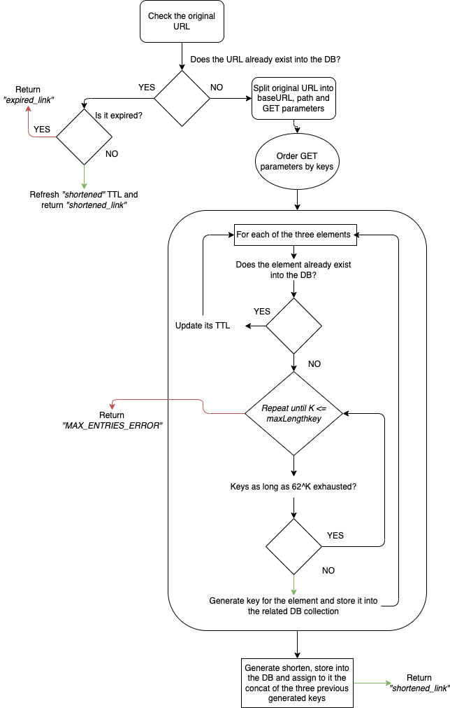

# URL shortener

## A brief description

This Python project offers the chance to shorten links according to a provided `max_length_key` to encode them and it keeps alive the shortened links by a given `TTL`. The storing of those links is based on MongoDB database plus a garbage collector

## Requirements installation

### Python

This shortener requires Python3: https://www.python.org/downloads/

Once it has been installed, follow these steps.

1. Open a terminal window
2. Write the following command, then press "ENTER":
```curl https://bootstrap.pypa.io/get-pip.py -o get-pip.py```
3. Write down this command to install pip pressing "ENTER":
```python3 get-pip.py```
4. The shortener has dependencies: to install them, there're two steps. First one, locate yourself into the shortener's folder with your terminal window like:
```cd ~/my_shortener``
    After, run write this command and press "ENTER" to confirm:

    ```pip install -r .shortener/requirements.txt```

    Once the dependencies' installation is complete, you'll be able to use the shortener.

### MongoDB

The shortener requires a MongoDB database. Please pay a visit to the official website to follow the instruction according to your operating system and/or to let the shortener reach out a remote database: https://www.mongodb.com/

### Tests

The tests can be launched by executing the following command:

```pytest ./tests```

## How to use me

It depends by the operation explained as follows.

### Minify a link

To minify a link, run in a terminal window:

```python3 shortener/main.py --minify https://www.your_website.com/the/related/path/test.php?your=query&parameter=33```

The `--minify` parameter is needed to let the shortener ingest the link.

### Expand a link

To expand a link, so that getting back the original link, run in a terminal window:

```python3 shortener/main.py --expand shortenedURL```

The `--expand` parameter is needed to let the shortener ingest the link.

## Garbage collector

To optimize the memory and the database usage, a garbage collector needs to get execute parallely: it's not mandatory, but if you reach out the **`max_length_key` power 62** you won't be able to generate link anymore. The garbage collector will scan the shortened link, the base URLs, paths and GET parameters inside of the relative collections: *when their TTL is reached out it will delete them **permanently***. 
The garbage collector executes the cleaning function every *garbage_collector_TTL* seconds: this value could be modified by editing the `config.json` file.

To run  it, open a terminal window and type:

```python3 shortener/garbage_collector_run.py```

*The garbage collector will run on a scheduled basis, until the process still stand alive.*

## Configuration

The shortener has a configuration file named `config.json` into the main project's folder. Its elements are described as follows:

- **mongoDB_URL**: the base URL of your database
- **mongoDB_port**: the opened port of your database
- **mongoDB_database**: your database name
- **garbage_collector_TTL**: the TTL expressed as seconds to consider expired the links
- **encryption_key_size**: the number of elements that can be used to generated encrypted shortened links.

## Docker build

You can create a Docker image by simply launching on the same project's folder:

```docker build -t your_image_name .```

## Encryption algorithm

The shortener works with an algorithim in order to guarantee uniqueness amongst generated links. It works based on the 26 letters of the alphabet, uppercase and lowercase, plus the ten numbers: *so that there are 62 elements to base the encryption*. The maximum number of keys for a given length (`maxLengthKey`) is calculated using the formula:

$`62^{maxLengthKey}`$`

This expression represents the total number of unique keys that can be generated by the algorithm for each element create by **splitting the original URL**.
The keys are generated **sequentially and ordered** by the following order:

`abcdefghijklmnopqrstuvwxyzABCDEFGHIJKLMNOPQRSTUVWXYZ0123456789`

If this limit is reached, *unless the garbage collector freed some keys*, the shortener **can't generate new keys**.

### URL splitting

The encryption is applied to each of the main three elements of an input URL:

- base URL: is the domain of the provided URL
- path: is the path provided as input following the base URL
- GET parameters: this is the representation of the GET paramaters provided


For instance, the following URL:

`https://www.your_website.com/the/related/path/test.php?your=query&parameter=33`

Will be split up as it follows:

- base URL: `www.your_website.com`
- path: `/the/related/path/test.php`
- GET parameters: `your=query&paramter=33`

### Key generation and store to the DB

The algorithm applies the URL splitting then, to found the mininum cost-key and to apply it in the future, it stores into the DB the following elements:

- shortened: This collection is based on elements having the shortened URL as key, then one key for each of the three main elements. In that way the algorithm can create the original URL again
- baseURL: the base URL plus its key
- path: the path plus its key
- getParams: the GET parameters ordered by key plus its key

*The "path" and the "getParams" are optional parts as per the original URL*

### Minimum cost-key

The algorithm searches for the shortest and earliest free key to be assigned to the given element. Since the garbage collector may remove some elmements asynchronously, the shortener, entitled for generating the keys, applies a binary search to looking for the most earliest and shortest free key to be used for a new element.

### The algorithm applied



